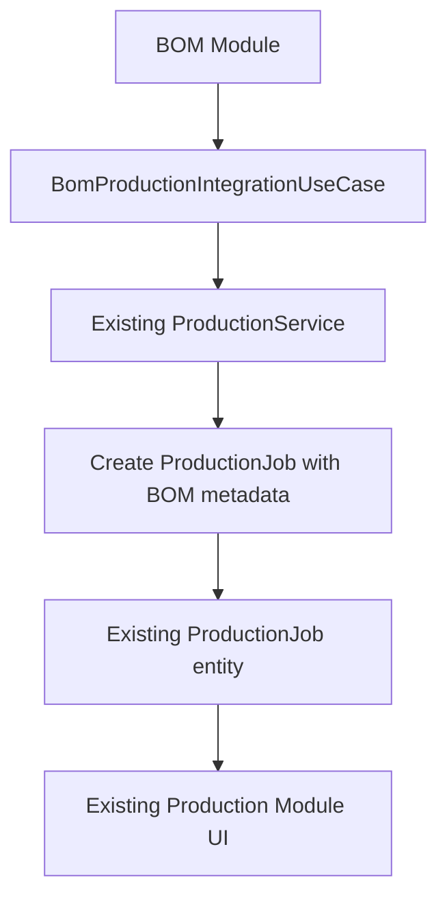
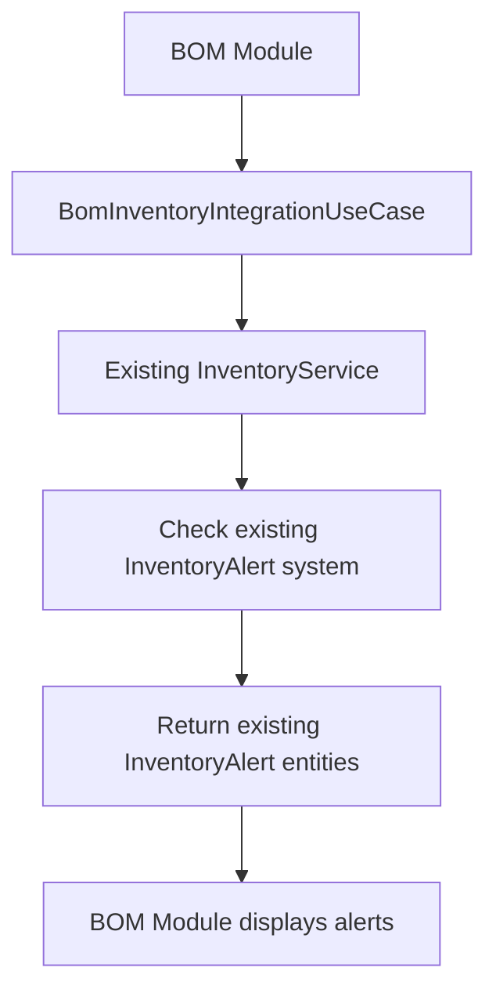

# BOM Module - Phase 2: CORRECTED Integration Approach

## ⚠️ CRITICAL ARCHITECTURAL ISSUE IDENTIFIED

**Problem**: The initial Phase 2 implementation duplicated functionality that already exists in dedicated modules, creating conflicts and architectural violations.

**Solution**: Refactor Phase 2 to properly integrate with existing modules instead of duplicating their functionality.

---

## 🔍 Existing Module Analysis

### **Inventory Module** - Already Has:
- ✅ `InventoryAlert` with expiry, low stock, and shortage alerts
- ✅ Alert severity levels and acknowledgment system
- ✅ Complete inventory tracking and management

### **Procurement Module** - Already Has:
- ✅ `PurchaseOrder` with comprehensive PO management
- ✅ `PurchaseOrderItem` with detailed line items
- ✅ `ProcurementPlan` for procurement planning
- ✅ Complete approval workflows and supplier management

### **Production Module** - Already Has:
- ✅ `ProductionJob` with status tracking and management
- ✅ `ProductionPlan` and `ProductionPlanItem`
- ✅ Quality checks and issue tracking
- ✅ Complete production scheduling and monitoring

### **Order Management Module** - Already Has:
- ✅ Order entities with fulfillment tracking
- ✅ Status management and workflow

---

## 🎯 CORRECTED Phase 2 Approach

### **Principle**: Integration, Not Duplication

BOM Phase 2 should **integrate with** existing modules, not **replace** or **duplicate** them.

---

## 📋 Corrected Implementation Plan

### **1. BOM-Specific Integration Entities**
Create only BOM-specific entities that don't exist elsewhere:

```dart
// NEW: BOM-specific integration entities
- BomAvailabilityRequest    // Request for checking BOM availability
- BomProcurementRequest     // Request for BOM-based procurement
- BomProductionRequest      // Request for BOM-based production
- BomIntegrationResult      // Results of cross-module operations
```

### **2. Integration Use Cases (Orchestrators)**
Create use cases that orchestrate between existing modules:

```dart
// CORRECTED: Integration orchestrators
- BomInventoryIntegrationUseCase    // Orchestrates with inventory module
- BomProcurementIntegrationUseCase  // Orchestrates with procurement module  
- BomProductionIntegrationUseCase   // Orchestrates with production module
- BomCrossModuleOrchestratorUseCase // Coordinates all integrations
```

### **3. Module Extensions (If Needed)**
Extend existing entities only when BOM-specific data is required:

```dart
// EXAMPLE: Extend existing PurchaseOrder if needed
extension BomPurchaseOrderExtension on PurchaseOrder {
  String? get bomId => metadata?['bomId'];
  String? get bomCode => metadata?['bomCode'];
  // Add BOM-specific getters that use existing metadata field
}
```

---

## 🔧 Corrected Technical Implementation

### **1. Inventory Integration**
```dart
class BomInventoryIntegrationUseCase {
  // Inject existing inventory services
  final InventoryService inventoryService;
  final InventoryAlertService alertService;
  
  // Use existing inventory functionality
  Future<List<InventoryAlert>> checkBomAvailability(String bomId) async {
    final bomItems = await bomRepository.getBomItems(bomId);
    final alerts = <InventoryAlert>[];
    
    for (final item in bomItems) {
      // Use EXISTING inventory alert system
      final itemAlerts = await alertService.getAlertsForItem(item.itemId);
      alerts.addAll(itemAlerts);
    }
    
    return alerts;
  }
}
```

### **2. Procurement Integration**
```dart
class BomProcurementIntegrationUseCase {
  // Inject existing procurement services
  final ProcurementService procurementService;
  
  // Use existing procurement functionality
  Future<PurchaseOrder> createPurchaseOrderFromBom(String bomId) async {
    final bomItems = await bomRepository.getBomItems(bomId);
    
    // Use EXISTING procurement system
    final poItems = bomItems.map((item) => PurchaseOrderItem(
      itemId: item.itemId,
      quantity: item.quantity,
      // ... other fields
    )).toList();
    
    // Use EXISTING PO creation
    return procurementService.createPurchaseOrder(
      items: poItems,
      metadata: {'bomId': bomId}, // Add BOM reference to existing metadata
    );
  }
}
```

### **3. Production Integration**
```dart
class BomProductionIntegrationUseCase {
  // Inject existing production services
  final ProductionService productionService;
  
  // Use existing production functionality
  Future<ProductionJob> createProductionJobFromBom(String bomId) async {
    final bom = await bomRepository.getBomById(bomId);
    
    // Use EXISTING production job creation
    return productionService.startProduction(
      bom.productId,
      metadata: {'bomId': bomId}, // Add BOM reference to existing metadata
    );
  }
}
```

---

## 🗂️ Corrected File Structure

### **Keep Existing Modules Intact**
```
lib/features/
├── inventory/          # ✅ KEEP - Use existing alerts, tracking
├── procurement/        # ✅ KEEP - Use existing PO system
├── production/         # ✅ KEEP - Use existing job system
├── order_management/   # ✅ KEEP - Use existing order system
└── bom/
    ├── domain/
    │   ├── entities/
    │   │   ├── bom_availability_request.dart     # NEW: BOM-specific
    │   │   ├── bom_procurement_request.dart      # NEW: BOM-specific
    │   │   ├── bom_production_request.dart       # NEW: BOM-specific
    │   │   └── bom_integration_result.dart       # NEW: BOM-specific
    │   └── usecases/
    │       ├── bom_inventory_integration_usecase.dart    # ORCHESTRATOR
    │       ├── bom_procurement_integration_usecase.dart  # ORCHESTRATOR
    │       ├── bom_production_integration_usecase.dart   # ORCHESTRATOR
    │       └── bom_cross_module_orchestrator_usecase.dart # COORDINATOR
    └── presentation/
        └── providers/
            └── bom_integration_providers.dart    # Integration providers
```

---

## 🔄 Corrected Integration Flow

### **Example: BOM to Production Workflow**


### **Example: BOM Availability Check**


---

## ✅ Benefits of Corrected Approach

### **1. No Duplication**
- ✅ Reuses existing, tested functionality
- ✅ Single source of truth for each domain
- ✅ Consistent behavior across modules

### **2. Proper Separation of Concerns**
- ✅ BOM module focuses on BOM-specific logic
- ✅ Other modules maintain their responsibilities
- ✅ Clear integration boundaries

### **3. Maintainability**
- ✅ Changes to inventory logic only need updates in inventory module
- ✅ BOM integration automatically benefits from improvements in other modules
- ✅ Easier testing and debugging

### **4. Scalability**
- ✅ New modules can integrate with BOM using same pattern
- ✅ Existing modules can evolve independently
- ✅ Clear extension points for future features

---

## 🚨 Action Required

### **Immediate Steps:**
1. **STOP** using the current Phase 2 implementation
2. **ANALYZE** existing module APIs and services
3. **REFACTOR** Phase 2 to use integration approach
4. **REMOVE** duplicate entities and functionality
5. **CREATE** proper integration use cases

### **Files to Remove/Refactor:**
- ❌ `availability_result.dart` - Use existing `InventoryAlert`
- ❌ `reservation.dart` - Extend existing inventory/order management
- ❌ `procurement_order.dart` - Use existing `PurchaseOrder`
- ❌ `production_order.dart` - Use existing `ProductionJob`

### **Files to Create:**
- ✅ `bom_integration_request.dart` - BOM-specific integration requests
- ✅ `bom_*_integration_usecase.dart` - Integration orchestrators
- ✅ `bom_integration_providers.dart` - Integration state management

---

## 🎯 Corrected Success Criteria

### **Integration Quality:**
- ✅ Zero duplication of existing functionality
- ✅ Proper use of existing module APIs
- ✅ Clean separation of concerns
- ✅ Consistent data flow and state management

### **Business Value:**
- ✅ BOM-driven workflows using existing systems
- ✅ Unified user experience across modules
- ✅ Reliable integration with proven components
- ✅ Future-proof architecture

---

**Status**: 🔴 **PHASE 2 REQUIRES ARCHITECTURAL CORRECTION**  
**Next Step**: Implement corrected integration approach  
**Priority**: **CRITICAL** - Must fix before proceeding 