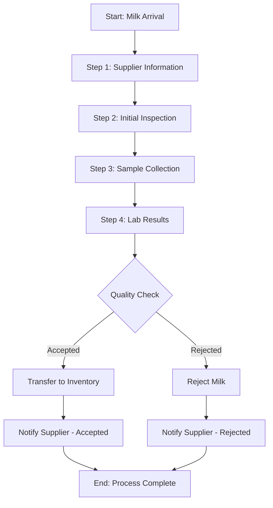

# Milk Reception Module Documentation

## Overview

The Milk Reception Module is a critical component of the dairy factory management system, responsible for managing the entire workflow of receiving raw milk from suppliers, assessing its quality, making acceptance decisions, and integrating with inventory management.

### Key Features

- Supplier and delivery information capture
- Initial milk inspection and quality assessment
- Sample collection and lab testing
- Quality-based grading and pricing
- Acceptance/rejection decision management
- Inventory integration for accepted milk
- Notification system for suppliers
- Comprehensive reporting and analytics

## Workflow

The milk reception process follows a standardized five-step workflow:



### Step 1: Supplier Information
- Capture supplier details
- Record driver information
- Document vehicle information
- Generate reception ID

### Step 2: Initial Inspection
- Record quantity of milk delivered
- Document type of milk (cow, goat, sheep, etc.)
- Note container type and count
- Measure temperature at arrival
- Perform visual inspection

### Step 3: Sample Collection
- Generate sample ID
- Record organoleptic evaluation (smell, appearance)
- Document any visible contamination
- Collect samples for lab testing

### Step 4: Lab Results
- Record fat content percentage
- Measure protein content percentage
- Document somatic cell count
- Test for antibiotics
- Assess bacteria levels
- Calculate total solids
- Measure acidity (pH)

### Step 5: Decision & Finalization
- Review all collected data
- Calculate quality grade
- Determine appropriate price based on quality
- Make acceptance/rejection decision
- Transfer accepted milk to inventory
- Send notifications to supplier

## Data Models

### MilkReceptionModel

The primary data model representing a milk reception record.

| Field                   | Type              | Description                              |
|-------------------------|-------------------|------------------------------------------|
| id                      | String            | Unique identifier                        |
| supplierId              | String            | ID of the supplier                       |
| supplierName            | String            | Name of the supplier                     |
| receptionStatus         | ReceptionStatus   | Current status of the reception          |
| timestamp               | DateTime          | Time when reception was created          |
| driverName              | String            | Name of the delivery driver              |
| vehiclePlate            | String            | Vehicle license plate                    |
| quantityLiters          | double            | Quantity of milk in liters              |
| milkType                | MilkType          | Type of milk delivered                   |
| containerType           | ContainerType     | Type of container used                   |
| containerCount          | int               | Number of containers                     |
| temperatureAtArrival    | double            | Temperature at arrival (°C)             |
| phValue                 | double            | pH value of the milk                     |
| smell                   | String            | Description of smell                     |
| appearance              | String            | Description of appearance                |
| hasVisibleContamination | bool              | Whether contamination is visible         |
| contaminationDescription| String            | Description of contamination if present  |
| notes                   | String            | Additional notes                         |
| photoUrls               | List<String>      | URLs of photos taken during reception    |
| tankDestination         | String            | Destination tank for accepted milk       |
| basePrice               | double            | Base price per liter                     |
| totalPaymentAmount      | double            | Total payment for the reception          |

### MilkQualityTestModel

Represents the quality test results for a milk reception.

| Field                | Type          | Description                                |
|----------------------|---------------|--------------------------------------------|
| id                   | String        | Unique identifier                          |
| receptionId          | String        | Reference to reception record              |
| timestamp            | DateTime      | Time when test was conducted               |
| technicianId         | String        | ID of lab technician                       |
| equipmentUsed        | String        | Equipment used for testing                 |
| sampleCode           | String        | Sample identification code                 |
| fatContent           | double        | Fat content percentage                     |
| proteinContent       | double        | Protein content percentage                 |
| lactoseContent       | double        | Lactose content percentage                 |
| totalSolids          | double        | Total solids percentage                    |
| somaticCellCount     | int           | Somatic cell count (cells/mL)             |
| bacterialCount       | int           | Bacterial count (CFU/mL)                  |
| antibioticsPresent   | bool          | Whether antibiotics were detected          |
| aflatoxinLevel       | double        | Aflatoxin level in ppb                    |
| addedWaterPercent    | double        | Percentage of added water                  |
| acidity              | double        | Acidity (pH value or °SH)                 |
| density              | double        | Density in kg/m³                         |
| freezingPoint        | double        | Freezing point in °C                      |
| qualityGrade         | QualityGrade  | Calculated quality grade                   |
| priceAdjustmentFactor| double        | Price adjustment factor based on quality   |

## Enums and Constants

### ReceptionStatus

```dart
enum ReceptionStatus {
  draft,           // Initial status when reception is being created
  pendingTesting,  // Reception is awaiting test results
  accepted,        // Reception is completed and milk was accepted
  rejected,        // Reception is completed and milk was rejected
}
```

### MilkType

```dart
enum MilkType {
  rawCow,
  rawGoat,
  rawSheep,
  pasteurizedCow,
  pasteurizedGoat,
  pasteurizedSheep,
  other
}
```

### ContainerType

```dart
enum ContainerType {
  aluminumCan,
  steelCan,
  plasticContainer,
  bulk,
  other
}
```

### QualityGrade

```dart
enum QualityGrade {
  gradeA,    // Premium quality
  gradeB,    // Standard quality
  gradeC,    // Substandard quality
  rejected   // Failed quality tests
}
```

## API Reference

### MilkReceptionService

The main service that orchestrates the milk reception process.

#### Methods

| Method                  | Parameters                         | Return Type         | Description                                 |
|-------------------------|------------------------------------|--------------------|---------------------------------------------|
| initiateReception       | supplierId, supplierName, etc.     | Future<String>     | Creates new reception record                |
| finalizeReception       | receptionId, accepted, notes       | Future<void>       | Finalizes reception with accept/reject      |
| getReceptionById        | receptionId                        | Future<MilkReceptionModel> | Retrieves a reception by ID           |
| getReceptionsBySupplier | supplierId, limit, startAfter      | Future<List<MilkReceptionModel>> | Gets receptions for a supplier  |
| getReceptionsByDateRange| start, end, limit, startAfter      | Future<List<MilkReceptionModel>> | Gets receptions in date range    |
| getReceptionsByStatus   | status, limit, startAfter          | Future<List<MilkReceptionModel>> | Gets receptions by status        |
| calculateQualityGrade   | receptionId, testResults           | Future<QualityGrade> | Calculates quality grade based on tests   |
| calculatePayment        | receptionId, basePrice, qualityFactor | Future<Map<String, dynamic>> | Calculates payment based on quality |

### ReceptionInventoryService

Service for integrating milk reception with inventory management.

#### Methods

| Method                | Parameters          | Return Type       | Description                              |
|-----------------------|---------------------|-------------------|------------------------------------------|
| transferMilkToInventory | receptionId       | Future<String>    | Transfers accepted milk to inventory     |
| getInventoryItemByReception | receptionId   | Future<InventoryItem> | Gets inventory item for a reception  |
| getCompletedReceptions | None               | Stream<List<MilkReceptionModel>> | Stream of completed receptions |

## Integration Points

### Inventory Integration

Accepted milk receptions are transferred to inventory using the `ReceptionInventoryService`. This creates an inventory item with the following attributes:
- Item type: Raw milk
- Quantity: Reception quantity in liters
- Source: Supplier information
- Quality grade: Calculated quality grade
- Reception reference: Link back to reception record
- Batch/lot number: Generated for traceability

### Supplier Management Integration

The module integrates with the Supplier Management module to:
- Validate supplier information
- Access supplier quality history
- Update supplier quality metrics
- Track supplier payments

### Notification System Integration

The module sends notifications to suppliers when:
- Reception is created
- Reception is accepted (with quality and payment details)
- Reception is rejected (with reason)

## Testing Strategy

### Unit Tests

- `MilkReceptionModel` validation logic
- `MilkQualityTestModel` calculations
- Business rules in `MilkReceptionService`
- Repository data operations

### Integration Tests

- Complete reception workflow
- Reception-to-inventory flow
- Notification triggering
- Analytics calculations

### Widget Tests

- Reception form validation
- Multi-step navigation
- Error state handling
- Dynamic UI updates based on input

## Error Handling

The module implements robust error handling:

- `BusinessLogicException` for business rule violations
- Data validation before persistence
- Graceful degradation for network issues
- User-friendly error messages

## Security and Permissions

The following role-based permissions apply:

- **Reception Operator**: Can create and view receptions
- **Lab Technician**: Can record test results
- **Quality Manager**: Can finalize receptions and override quality checks
- **Administrator**: Has full access to all features

## Best Practices

1. Always complete the reception workflow within 24 hours of milk arrival
2. Collect samples immediately upon reception
3. Perform lab tests in a timely manner
4. Document any quality issues with photos
5. Follow established quality standards for acceptance/rejection decisions
6. Maintain proper documentation for traceability

## Sample Code

### Creating a New Reception

```dart
final receptionService = MilkReceptionService(
  receptionRepository: FirestoreMilkReceptionRepository(),
  inventoryRepository: FirestoreInventoryRepository(),
  supplierRepository: FirestoreSupplierRepository(),
  notificationService: FCMNotificationService(),
);

final receptionId = await receptionService.initiateReception(
  supplierId: 'supplier-123',
  supplierName: 'Dairy Farm Inc.',
  vehiclePlate: 'ABC-123',
  driverName: 'John Doe',
  quantityLiters: 500.0,
  milkType: MilkType.rawCow,
  containerType: ContainerType.aluminumCan,
  containerCount: 5,
  initialObservations: 'Normal appearance',
  receivingEmployeeId: 'employee-456',
  temperatureAtArrival: 4.2,
  smell: 'Normal',
  appearance: 'White liquid',
  hasVisibleContamination: false,
);
```

### Processing Lab Results

```dart
final testResults = MilkQualityTestModel(
  id: '',
  receptionId: receptionId,
  timestamp: DateTime.now(),
  technicianId: 'lab-tech-1',
  equipmentUsed: 'MilkoScan FT1',
  sampleCode: 'S001',
  fatContent: 3.8,
  proteinContent: 3.3,
  lactoseContent: 4.7,
  totalSolids: 12.8,
  somaticCellCount: 180000,
  bacterialCount: 45000,
  antibioticsPresent: false,
  aflatoxinLevel: 0.2,
  addedWaterPercent: 0.5,
  acidity: 6.8,
  density: 1032.0,
  freezingPoint: -0.530,
);

// Calculate quality grade
final qualityGrade = testResults.calculateQualityGrade();

// Calculate price adjustment factor
final priceAdjustment = testResults.calculatePriceAdjustmentFactor();
```

### Handling Reception Decision

```dart
// Accept the reception
await receptionService.finalizeReception(
  receptionId: receptionId,
  accepted: true,
  notes: 'Good quality milk, all parameters within acceptable range',
);

// Or reject the reception
await receptionService.finalizeReception(
  receptionId: receptionId,
  accepted: false,
  notes: 'Antibiotics present, milk rejected',
);
```

## Troubleshooting

### Common Issues

1. **Reception stuck in pendingTesting status**
   - Verify that lab results were properly recorded
   - Check for pending quality tests

2. **Inventory integration failing**
   - Ensure reception is in accepted status
   - Verify inventory repository is available
   - Check that tank destination is specified

3. **Quality calculations incorrect**
   - Verify test result data accuracy
   - Check quality parameter thresholds
   - Review quality grade calculation logic

## Analytics and Reporting

The milk reception module provides data for several reports:

1. **Daily Reception Summary**
   - Total volume received
   - Average quality metrics
   - Acceptance rate

2. **Supplier Quality Trends**
   - Quality metrics over time by supplier
   - Rejection rates by supplier
   - Average quality grade by supplier

3. **Inventory Impact Report**
   - Volume added to inventory
   - Quality distribution of raw materials
   - Rejection rate impact on production planning 